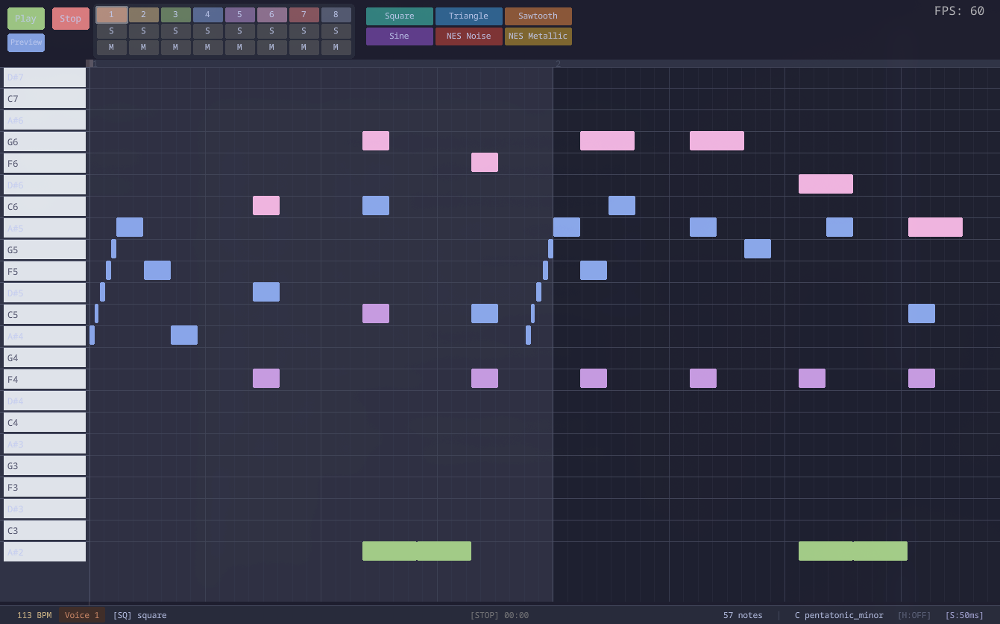

# boostio

This is a music composition program orginally made with the goal to make it easier to make music for the [rvasec badge](https://badge2025.hackrva.org/pages/about/).  It's not exactly 1to1 with the audio api on the badge (particularly the noice instrument doesn't translate over).

If you are working on songs for the badge, it may make sense to create your songs in parts and take advantage of the badge music api to arrange the parts.

There's currently no file loading in the app.  To create a new file, pass the desired filepath as an argument.
e.g.
```bash
./boostio ./examples/another_song.json
```

<kbd>ctr+s</kbd> will save a json file and export a wav and c file.

## Building

Download the git submodules (only necessary on first run):
```bash
git submodule update --init --recursive
```

run cmake:
```bash
bash ./run_cmake.sh
```

build the project:
```bash
cd ./buid/Linux/
make
```

(technically this should be runnable on mac and windows as well, but I haven't done much testing around that)





## Plugins

`boostio` is very plugin driven.
by default `boostio` will look in `~/.local/share/boostio/` for your plugins and `~/.config/boostio` for your config file.
You can overwrite these directories by setting `BOOSTIO_BINARY_DIR` and `BOOSTIO_CONFIG_DIR`.

If you clone this repo and run `bash ./scripts/copy_lua.sh` it should copy the appropriate files to the appropriate dirs.
If you don't have these files in place, you will likely just see a grey window when you run the app.


### Writing Plugins
Take a look at `./boostio.lua` to see the function signatures of the lua api. 
